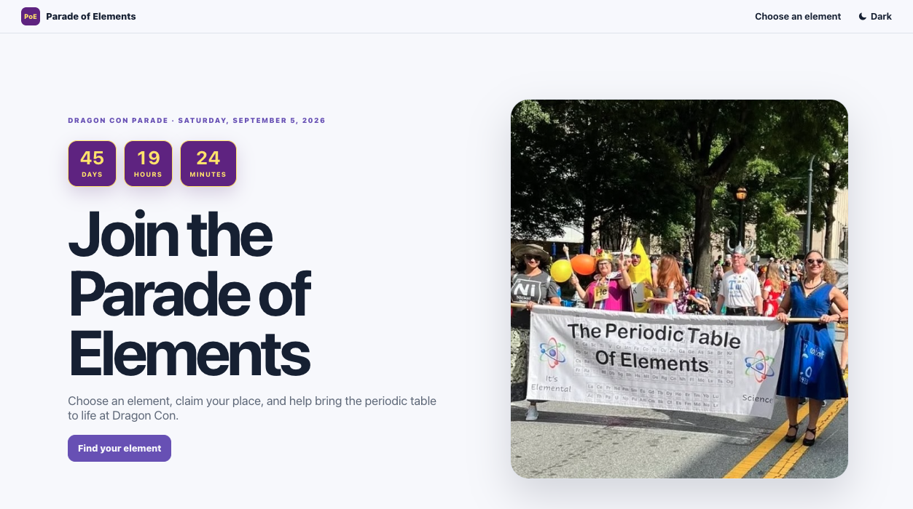
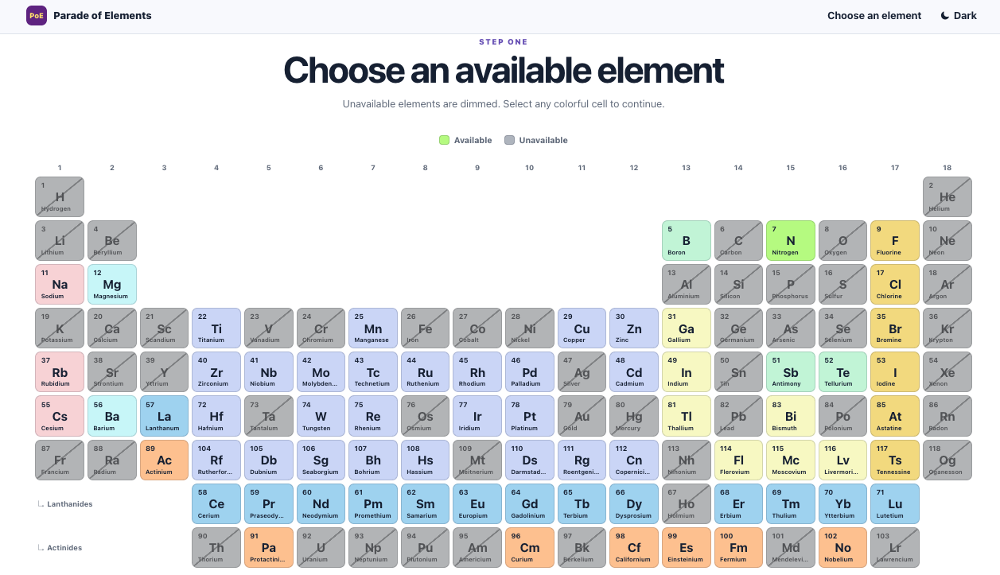
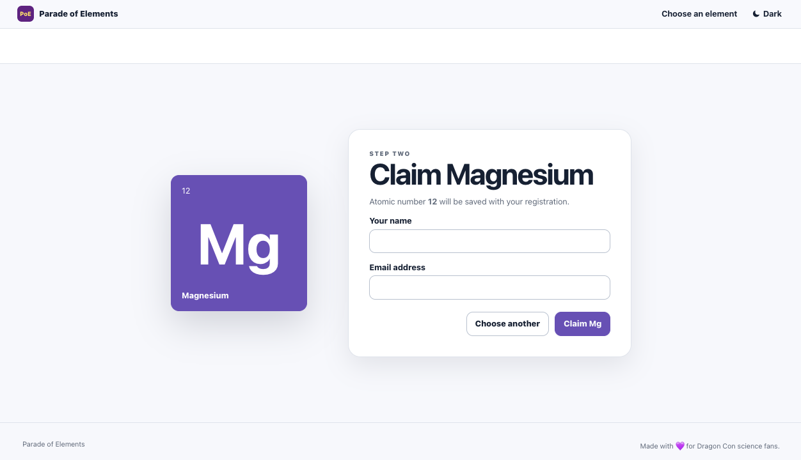

# Parade of Elements 

## Interactive periodic table for the group marching each year in the Dragon Con parade.

### Phase 1 Display PT that allows the user to see available elements and select an element to represent.

Step 1: Make a styled PT grid where each cell can be turned into a clickable element. ✅

Step 2: Manage state of elements ✅

Set up a Firestore db with element 'status' of available/unavailable that FE uses to display element dynamically - and fast! (still manually updating status in db) Also got rid of 'pending' for now. In the KISS phase for now.

Step 3: Make elements selectable => updates state ✅

Updated styling, added navbar, smooth scroll, and light/dark toggle for funsies.

Added form and linked it to Firestore database, only updates 'available' elements.

And she's responsive.

### Phase 2 Automate emails to parade admin and user to verify element selection and share basic parade group instructions  ✅

Created Render account (me) and set up Firebase function to sent confirmation email to user and a claimed announcement to admin email (gmail)

### Phase 3 Get it hosted (free on Firebase and can use our current domain)

Converted hosting from goDaddy (or whatever was hosting it - that was frustrating) to Firestore.

### Phase 4 Store all user/element info in a database for subsequent years

Only one flat year for now. Will resume more complex structure after this year's parade.

## She's Live!!!
https://paradeofelements.org/

### Phase 5+ Create an admin dashboard that controls all this, add features for historical info, assign/reassign ability, automate communication for each year's process

